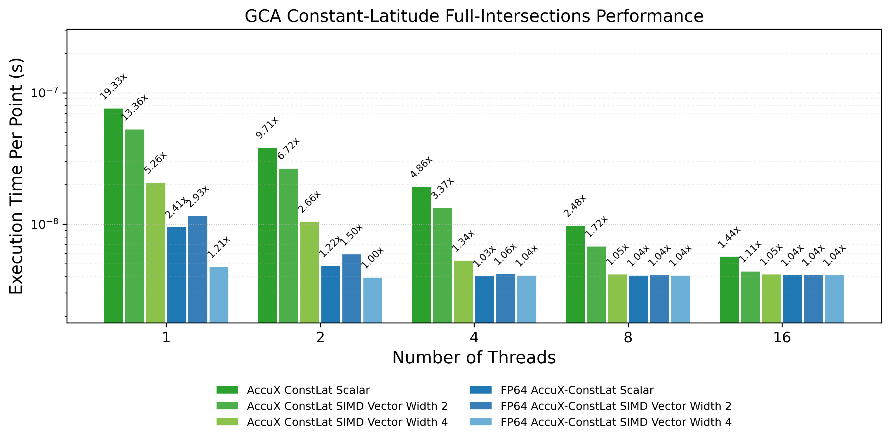
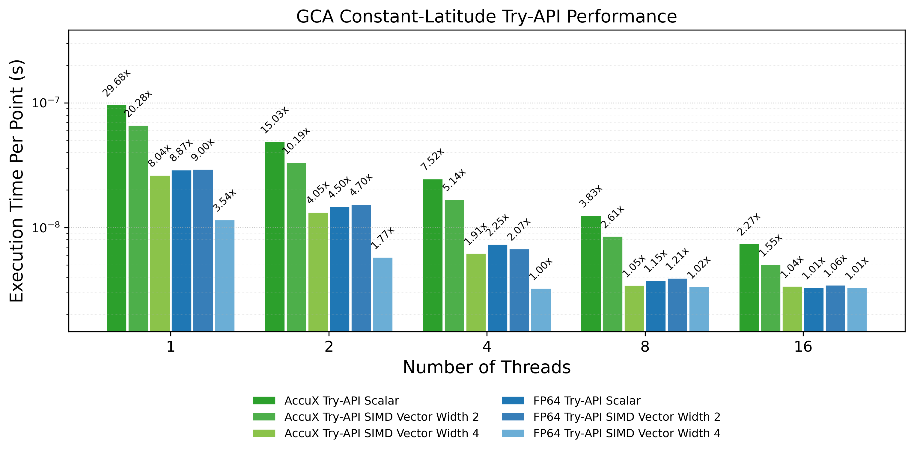
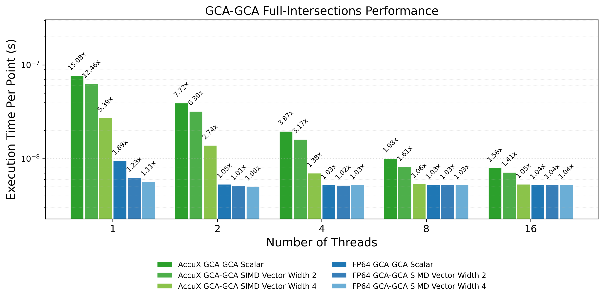
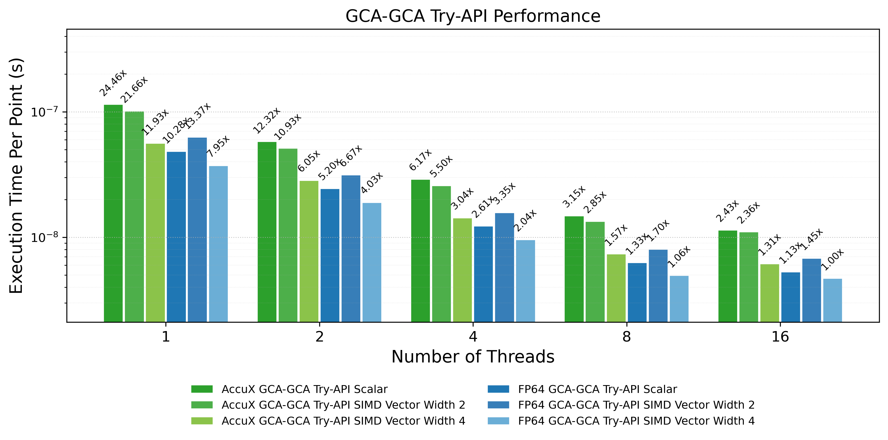

# Performance Tests for the Intersection APIs

These performance tests are intended to show that, when parallelized and vectorized appropriately, the vectorized implementations of `AccuXGCA` and `AccuXConstLat` approach and eventually closely match the performance of pure floating-point code as SIMD vector width and OpenMP thread count increase.

This behavior is expected because the intersection-point calculation is not especially compute-intensive. After batching, vectorization, and multithreading, the additional arithmetic required by `AccuX` can be largely hidden by memory I/O and data-movement bottlenecks. As a result, for batch-processing applications on parallel machines, the accurate results from the `AccuX` algorithms can be obtained with essentially no compute-time overhead relative to a naive floating-point implementation.

These claims are also supported by the following publications:

1. Chen, H., Ullrich, P. A., Panetta, J., Marsico, D., Hanke, M., Jain, R., Zhang, C., and Jacob, R. L. (2026). "Accurate and Robust Geometric Algorithms for Regridding on the Sphere." *EGUsphere* (preprint). https://doi.org/10.5194/egusphere-2026-636
2. Chen, H., Ullrich, P. A., and Panetta, J. (2026). "Fast and Accurate Intersections on a Sphere." *SIAM Journal on Scientific Computing*, 48, B208-B232. https://doi.org/10.1137/25M1737614

---

## What this benchmark is testing

The goal of this benchmark is **performance**, not accuracy.

Accuracy is tested separately in the regular unit/baseline tests, for example:

* [`tests/test_gca_constlat_intersection_baseline.cpp`](../test_gca_constlat_intersection_baseline.cpp)

This benchmark asks a different question:

> If a developer integrates the `AccuX` API into a large batch-processing workflow, and the workflow is parallelized and vectorized correctly, does the accurate `AccuX` API still preserve the expected high-throughput performance characteristics?

For that reason, this benchmark compares two families of APIs:

1. A naive floating-point baseline API.
2. The corresponding `AccuX` API.

The comparison is intentionally done at the **full API level**, not only at the internal formula level. This means the benchmark stores the same kind of outputs for both implementations.

---

## Full-API fairness

For a performance comparison to be meaningful, the floating-point baseline and the `AccuX` API must have the same benchmark shape.

For the lower-level constant-latitude intersection API, both implementations return both candidate intersections:

```cpp
GcaConstLatIntersections<T> {
  Vec3<T> point_pos;
  Vec3<T> point_neg;
}
```

For the higher-level try API, both implementations return the selected point and a status value:

```cpp
GcaConstLatTryResult<T> {
  Vec3<T> point;
  T status;
}
```

The benchmark therefore stores the full API result, rather than storing only one coordinate or only one branch of the result. This is important because storing less output for one implementation would make the timing comparison unfair.

The benchmark currently compares:

| AccuX API                       | Floating-point baseline              |
| ------------------------------- | ------------------------------------ |
| `accux_constlat`                | `fp64_gca_constlat`                  |
| `try_gca_constlat_intersection` | `fp64_try_gca_constlat_intersection` |

---

## Files used by the `gca_constlat_intersection.hpp` API benchmarks

The main files for the constant-latitude benchmark are:

* Benchmark source: [`gca_constLat/benchmark_gca_constlat_SIMDPack.cpp`](gca_constLat/benchmark_gca_constlat_SIMDPack.cpp)
* Floating-point baseline: [`gca_constLat/fp64_GCAconstLat.hh`](gca_constLat/fp64_GCAconstLat.hh)
* Plotting script: [`gca_constLat/plot_gca_constlat_SIMDPack.py`](gca_constLat/plot_gca_constlat_SIMDPack.py)
* Benchmark driver script: [`gca_constLat/run_gca_constlat_SIMDPack_benchmark.sh`](gca_constLat/run_gca_constlat_SIMDPack_benchmark.sh)
* Output directory: [`gca_constLat/output/`](gca_constLat/output/)

The production API being benchmarked is:

* [`include/accusphgeom/constructions/gca_constlat_intersection.hpp`](../../include/accusphgeom/constructions/gca_constlat_intersection.hpp)

The output files produced by the benchmark are:

* `gca_constLat/output/gca_constlat_SIMDPack_timing_repeats.csv`
* `gca_constLat/output/gca_constlat_SIMDPack_timing_summary.csv`
* `gca_constLat/output/gca_constlat_SIMDPack_timing.png`
* `gca_constLat/output/gca_constlat_SIMDPack_timing_try.png`

The repeats CSV stores individual timing repeats. The summary CSV stores the minimum, median, and mean timing for each method, thread count, and SIMD width. The plots use the summary timing.

---

## Scalar and SIMD paths

Vectorization is implemented with Eigen and C++ templates.

The scalar path and SIMD-pack paths are intentionally separate:

* Scalar floating point uses `double`.
* SIMD vector width `N` uses `Eigen::Array<double, N, 1>`.

In this repository, the adapter defines:

```cpp
template <int N>
using EigenPack = Eigen::Array<double, N, 1>;
```

The benchmark uses:

* Width `1`: direct scalar `double`
* Width `2`: `EigenPack<2>`
* Width `4`: `EigenPack<4>`
* Width `8`: `EigenPack<8>`

The width-1 case is **not** `EigenPack<1>`. This matters because vector-width-1 code can still introduce abstraction overhead relative to a direct scalar implementation.

On Perlmutter CPU nodes, the natural SIMD width for double precision is usually width `4` because the CPU supports AVX2 256-bit vectors. Width `8` may be compiled as two 256-bit chunks rather than one native 512-bit vector. Therefore, width `8` is not always faster than width `4`.

---

## Input data and accuracy

The benchmark uses a large batch of floating-point input points. The input values are chosen to exercise the API in a stable, repeatable way for performance measurement.

For this benchmark, the exact geometric classification of the input is not the focus. The benchmark is intended to measure throughput of the API under batch processing. Accuracy and robustness should be validated separately using the accuracy-oriented tests.

The higher-level `try_gca_constlat_intersection` API uses mask-style logic to select a valid intersection and return a status value. This avoids exception-based scalar control flow in the benchmark path and allows the same API shape to work for both scalar and SIMD-pack types.

Do not benchmark the throwing scalar-only wrapper for SIMD performance. The benchmark should compare:

```cpp
try_gca_constlat_intersection(...)
```

against:

```cpp
fp64_try_gca_constlat_intersection(...)
```

not the exception-throwing scalar convenience wrapper.

---

## Compilation flags

The benchmark is compiled in Release mode with flags such as:

```text
-O3 -march=native -ffp-contract=off -fno-fast-math
```

Disabling floating-point contraction is intentional. It prevents the compiler from silently contracting multiply/add sequences into FMA instructions in places where the numerical analysis assumes the literal IEEE 754 operation sequence.

The benchmark also uses OpenMP for thread-level parallelism.

---

## Running the benchmark on Perlmutter

The benchmark driver script is designed for NERSC Perlmutter CPU nodes.

A typical interactive allocation is:

```bash
salloc -N 1 -q interactive -t 00:30:00 -C cpu -A <YOUR_ACCOUNT> \
  --ntasks=1 --cpus-per-task=16
```

Then run:

```bash
cd /global/homes/h/hyvchen/AccuSphGeom

THREADS=16 DATA_SIZE=2000000 NUM_TESTS=50 NUM_REPEATS=7 \
tests/performance_test/gca_constLat/run_gca_constlat_SIMDPack_benchmark.sh
```

The important part of the run command is:

```bash
srun -n 1 -c "${THREADS}" --cpu-bind=cores \
  "${BUILD_DIR}/${TARGET}" "${DATA_SIZE}" "${NUM_TESTS}" "${NUM_REPEATS}"
```

Here:

* `-n 1` means one benchmark process.
* `-c "${THREADS}"` gives that process enough logical CPUs for the requested OpenMP threads.
* `OMP_NUM_THREADS="${THREADS}"` controls the number of OpenMP threads used by the benchmark.
* `--cpu-bind=cores` binds the benchmark process to the allocated CPU resources.

Do not use `-c 1` for a 16-thread benchmark run. That would either limit the process to one logical CPU or oversubscribe the allocation, depending on the environment.

---

## Choosing `DATA_SIZE`

The benchmark is sensitive to data size. If the data size is too small, the measured time per point can be dominated by cache effects, OpenMP overhead, warmup effects, or other microbenchmark artifacts. In that regime, the performance ratio may not represent the steady-state throughput of a large batch-processing application.

For Perlmutter, a saturation sweep should be used to choose a stable data size. In the current Perlmutter setup, a conservative saturated value for the `accux_*` full-intersections benchmarks is:

```bash
DATA_SIZE=2000000
```

This `DATA_SIZE=2000000` guidance is for the `accux_*` APIs only. The higher-level `try_*` APIs can saturate at a different, often larger, data size because the saturation size depends on the computation cost of the function being benchmarked. More expensive APIs generally need a larger `DATA_SIZE` before the timing is dominated by steady-state compute throughput rather than benchmark overhead.

For another machine, or for a different API family on the same machine, do not assume this value is correct. Rerun the saturation sweep and choose a data size where the median time per point stops changing significantly as the data size increases.

A practical rule is:

> Increase `DATA_SIZE` until both the best floating-point timing and the best `AccuX` timing for that specific API stabilize, and until the ratio between them is also stable.

---

## Benchmark outputs

The benchmark writes two CSV files:

```text
gca_constLat/output/gca_constlat_SIMDPack_timing_repeats.csv
gca_constLat/output/gca_constlat_SIMDPack_timing_summary.csv
```

The repeats CSV has rows like:

```text
method,threadsNum,vec_width,repeat,time
```

The summary CSV has rows like:

```text
method,threadsNum,vec_width,min_time,median_time,mean_time
```

The `time` values are seconds per point.

The plotting script generates:

```text
gca_constLat/output/gca_constlat_SIMDPack_timing.png
gca_constLat/output/gca_constlat_SIMDPack_timing_try.png
```

The first plot compares:

```text
pure_fp
accux
```

for the lower-level full-intersections API.

The second plot compares:

```text
pure_fp_try
accux_try
```

for the higher-level try API.

The bar labels are ratios relative to the fastest implementation at the same thread count. Therefore, values close to `1.00x` indicate that the method is close to the fastest implementation in that thread group.

---

## `accux_constlat` API benchmark results

Here we present the benchmark for `accux_constlat` from:

* [`include/accusphgeom/constructions/gca_constlat_intersection.hpp`](../../include/accusphgeom/constructions/gca_constlat_intersection.hpp)

and the naive floating-point baseline:

* [`fp64_gca_constlat`](gca_constLat/fp64_GCAconstLat.hh)



The results show that `accux_constlat` eventually closely matches the performance of the pure floating-point code as SIMD vector width and OpenMP thread count increase.

---

## `try_gca_constlat_intersection` API benchmark results

Here we present the benchmark for `try_gca_constlat_intersection` from:

* [`include/accusphgeom/constructions/gca_constlat_intersection.hpp`](../../include/accusphgeom/constructions/gca_constlat_intersection.hpp)

and the naive floating-point baseline:

* [`fp64_try_gca_constlat_intersection`](gca_constLat/fp64_GCAconstLat.hh)



The results show that the higher-level try API also preserves the same performance behavior under batch processing, vectorization, and OpenMP parallelization.

We conclude that, for applications involving batch processing of large input sets on a parallel machine, the accurate results from the `AccuX` API can be obtained with essentially no compute-time overhead relative to a naive floating-point implementation.

---

## The `gca_gca_intersection.hpp` API benchmarks

Similarly, we also present the benchmark for GCA x GCA intersection here.

The corresponding benchmark files are:

* [`gca_gca/benchmark_gca_gca_SIMDPack.cpp`](gca_gca/benchmark_gca_gca_SIMDPack.cpp)
* [`gca_gca/fp64_GCAGCA.hh`](gca_gca/fp64_GCAGCA.hh)
* [`gca_gca/plot_gca_gca_SIMDPack.py`](gca_gca/plot_gca_gca_SIMDPack.py)
* [`gca_gca/run_gca_gca_SIMDPack_benchmark.sh`](gca_gca/run_gca_gca_SIMDPack_benchmark.sh)
* Output directory: [`gca_gca/output/`](gca_gca/output/)

The `gca_gca` benchmark outputs are:

* `gca_gca/output/gca_gca_SIMDPack_timing_repeats.csv`
* `gca_gca/output/gca_gca_SIMDPack_timing_summary.csv`
* `gca_gca/output/gca_gca_SIMDPack_timing.png`
* `gca_gca/output/gca_gca_SIMDPack_timing_try.png`

The repeats CSV stores individual timing repeats. The summary CSV stores the minimum, median, and mean timing for each method, thread count, and SIMD width. The plots use the summary timing.

---

## `accux_gca` API benchmark results

Here we present the benchmark for `accux_gca` from:

* [`include/accusphgeom/constructions/gca_gca_intersection.hpp`](../../include/accusphgeom/constructions/gca_gca_intersection.hpp)

and the naive floating-point baseline:

* [`fp64_gca_gca`](gca_gca/fp64_GCAGCA.hh)



The results show that `accux_gca` eventually closely matches the performance of the pure floating-point code as SIMD vector width and OpenMP thread count increase.

---

## `try_gca_gca_intersection` API benchmark results

Here we present the benchmark for `try_gca_gca_intersection` from:

* [`include/accusphgeom/constructions/gca_gca_intersection.hpp`](../../include/accusphgeom/constructions/gca_gca_intersection.hpp)

and the naive floating-point baseline:

* [`fp64_try_gca_gca_intersection`](gca_gca/fp64_GCAGCA.hh)



The results show that the higher-level try API also preserves the same performance behavior under batch processing, vectorization, and OpenMP parallelization.

We conclude that, for applications involving batch processing of large input sets on a parallel machine, the accurate results from the `AccuX` API can be obtained with essentially no compute-time overhead relative to a naive floating-point implementation.

---

## Checklist for reproducing the benchmarks

This checklist is intended to help users reproduce the benchmark on their own machines. This performance test is non-trivial, delicate, and often confusing for users who are not already familiar with SIMD and HPC performance benchmarking. The goal of the checklist is to make the setup process easier to follow, easier to verify, and less frustrating to reproduce.

* [ ] Build the project in Release mode.
* [ ] Confirm that the benchmark is compiled with optimization flags such as `-O3 -march=native -ffp-contract=off -fno-fast-math`.
* [ ] Confirm that OpenMP is enabled for the benchmark target.
* [ ] Set up the naive floating-point API for the API level you want to benchmark.
* [ ] Set up the corresponding `accux_*` API.
* [ ] Make sure both API families return the same full API output shape.
* [ ] Make sure the scalar path uses direct `double`, not `EigenPack<1>`.
* [ ] Make sure the SIMD path uses the same pack type for both the naive floating-point implementation and the `AccuX` implementation.
* [ ] Before using the real `AccuX` arithmetic, temporarily replace only the implementation body inside the `accux_*` API with the same implementation used in the naive floating-point API. Keep the API entry point, return type, and output storage unchanged.
* [ ] Run the benchmark between the naive floating-point API and this temporary same-implementation `accux_*` API.
* [ ] Confirm that the two API entry points produce highly similar, and ideally nearly identical, performance.
* [ ] If the performance is not similar at this stage, inspect the engineering design carefully before continuing.
* [ ] Common things to inspect include inlining visibility, translation-unit separation, output storage, scalar-vs-pack dispatch, OpenMP run order, and repeated-trial stability.
* [ ] Restore the real `AccuX` implementation.
* [ ] Measure the saturation data size for your system.
* [ ] Update either `DATA_SIZE` in [`gca_constLat/run_gca_constlat_SIMDPack_benchmark.sh`](gca_constLat/run_gca_constlat_SIMDPack_benchmark.sh) or `kDefaultDataSize` in [`gca_constLat/benchmark_gca_constlat_SIMDPack.cpp`](gca_constLat/benchmark_gca_constlat_SIMDPack.cpp) to match your measured saturation size.
* [ ] Rerun the benchmark using the saturation data size.
* [ ] Confirm that the naive floating-point API performance is stable at the chosen data size.
* [ ] Confirm that the `AccuX` API performance is also stable at the chosen data size.
* [ ] Confirm that, with the optimized setup and saturation data size, the `accux_*` APIs show no meaningful computational overhead relative to the naive floating-point APIs.

---

## Note: why the temporary same-implementation sanity check is required

The temporary same-implementation sanity check is not a mathematical accuracy test. It is an engineering fairness test.

The idea is simple:

> If two API entry points contain the same arithmetic and store the same output, then their performance should be nearly the same.

If they are not nearly the same, the timing difference is probably caused by the benchmark harness or by code structure rather than by the `AccuX` algorithm itself.

For example, one implementation might be header-inline and visible to the benchmark translation unit, while the other might be compiled out-of-line in a separate `.cc` file. In that situation, the compiler may inline one implementation into the OpenMP loop but leave the other as a real function call. The arithmetic can be identical, but the benchmark will still report different timings. That is not a fair algorithmic comparison.

This check is especially important for SIMD and OpenMP microbenchmarks because small engineering differences can dominate timing results. The temporary same-implementation check helps verify that the benchmark is comparing the cost of the real `AccuX` arithmetic, not avoidable overhead from API layout, inlining, dispatch, output storage, or measurement noise.

After this check passes, the temporary implementation should be removed and the real `AccuX` implementation should be restored. Only then should the final `AccuX` performance result be interpreted.
